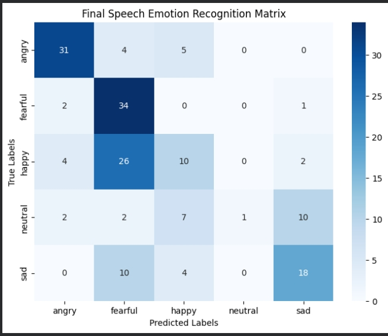
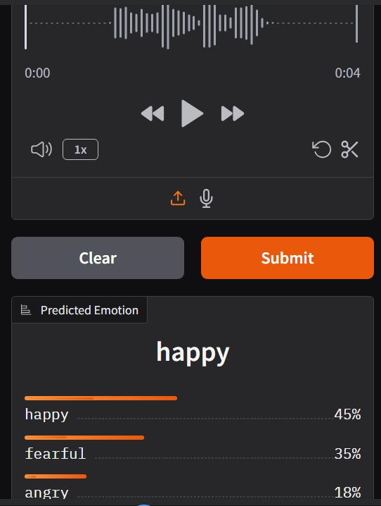
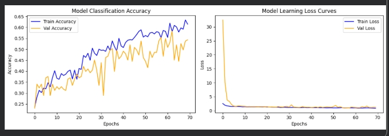

# 🎙️ Speech Emotion Recognition Using Deep 1D-CNN Networks

## Project Overview

Speech Emotion Recognition (SER) is an Artificial Intelligence application that identifies human emotions from speech signals. Human speech contains emotional patterns that can be analyzed using signal processing and deep learning techniques.

This project develops a real-time Speech Emotion Recognition system capable of classifying speech recordings into five emotions:

* Angry
* Fearful
* Happy
* Neutral
* Sad

The system uses acoustic feature extraction techniques and a Deep 1D Convolutional Neural Network (1D-CNN) to perform emotion classification. A real-time web application was also developed using Gradio for live emotion prediction.

---

##  Project Objective

The primary objective of this project is to develop an AI-based system capable of recognizing human emotions from speech recordings by analyzing vocal characteristics such as frequency, pitch, energy, and spectral properties.

---

##  Dataset Used

**RAVDESS (Ryerson Audio-Visual Database of Emotional Speech and Song)**

Dataset Details:

* Total Audio Files Processed: 864
* Training Samples: 691
* Testing Samples: 173
* Emotion Classes: 5

Selected Emotions:

* Angry
* Fearful
* Happy
* Neutral
* Sad

---

##  Features Extracted

A 44-dimensional feature vector was generated for every audio sample.

### 1. MFCC (Mel-Frequency Cepstral Coefficients)

* 40 coefficients extracted
* Captures important speech characteristics
* Mimics human auditory perception

### 2. Pitch

* Extracted using Librosa PipTrack
* Represents vocal frequency variations

### 3. RMS Energy

* Measures speech intensity and loudness
* Useful for identifying emotional strength

### 4. Zero Crossing Rate (ZCR)

* Measures signal sign changes
* Represents vocal sharpness and dynamics

### 5. Spectral Centroid

* Represents frequency center of mass
* Indicates sound brightness

### Final Feature Vector

| Feature            | Count  |
| ------------------ | ------ |
| MFCC               | 40     |
| Pitch              | 1      |
| RMS Energy         | 1      |
| Zero Crossing Rate | 1      |
| Spectral Centroid  | 1      |
| **Total Features** | **44** |

Dataset Shape:

864 × 44

---

##  Deep Learning Model Architecture

A Deep 1D Convolutional Neural Network (1D-CNN) was developed for emotion classification.

### Architecture

#### Convolution Block 1

* Conv1D (256 Filters)
* Kernel Size = 5
* ReLU Activation
* Batch Normalization
* MaxPooling1D

#### Convolution Block 2

* Conv1D (128 Filters)
* ReLU Activation
* Batch Normalization
* MaxPooling1D
* Dropout (0.2)

#### Convolution Block 3

* Conv1D (64 Filters)
* ReLU Activation
* Batch Normalization
* MaxPooling1D
* Dropout (0.3)

#### Fully Connected Layers

* Flatten Layer
* Dense Layer (512 Neurons)
* Dropout (0.4)

#### Output Layer

* Softmax Activation
* 5 Emotion Classes

---

## ⚙️ Technologies Used

### Development Environment

* Google Colab (GPU Runtime)

### Programming Language

* Python 3

### Libraries

* TensorFlow
* Keras
* Librosa
* NumPy
* Scikit-Learn
* Matplotlib
* Seaborn
* Gradio

---

## Workflow

Audio Input (.wav)

↓

Audio Preprocessing

↓

Feature Extraction

↓

Feature Vector Creation

↓

Label Encoding

↓

Deep 1D-CNN Training

↓

Emotion Classification

↓

Real-Time Gradio Deployment

---

##  Model Performance

### Classification Report

| Emotion | Precision | Recall | F1-Score |
| ------- | --------- | ------ | -------- |
| Angry   | 0.73      | 0.80   | 0.76     |
| Fearful | 0.41      | 0.73   | 0.52     |
| Happy   | 0.32      | 0.43   | 0.37     |
| Neutral | 0.67      | 0.09   | 0.16     |
| Sad     | 1.00      | 0.12   | 0.22     |

### Overall Results

| Metric            | Value |
| ----------------- | ----- |
| Accuracy          | 48%   |
| Macro F1 Score    | 0.41  |
| Weighted F1 Score | 0.44  |

---

##  Key Observations

* Angry emotion achieved the best performance with an F1-score of 0.76.
* Fearful emotion achieved strong recall performance.
* Sad emotion achieved a precision score of 1.00, indicating zero false positive predictions.
* Neutral and Happy emotions were comparatively harder to classify due to overlapping speech characteristics.

---

##  Real-Time Deployment

The trained model was integrated with the Gradio framework to provide a real-time web-based user interface.

Features:

* Microphone Recording
* Audio File Upload
* Instant Emotion Prediction
* Confidence Score Visualization
* Browser-Based Access

---

##  Outputs
### Confusion Matrix

### Gradio User Interface

### Training Curves / Evaluation Output

---

##  Future Enhancements

* Multilingual Emotion Recognition
* Tamil Speech Emotion Detection
* Transformer-Based Models (Wav2Vec 2.0)
* Larger Emotional Speech Datasets
* Improved Noise Handling
* Cloud Deployment

---

##  Internship Learning Outcomes

Through this project, the following concepts were learned:

* Audio Signal Processing
* Feature Engineering
* Speech Analysis
* Deep Learning with CNN
* Model Evaluation Metrics
* Real-Time AI Application Deployment
* Human Emotion Recognition using Artificial Intelligence

---

##  Conclusion

This project successfully developed a Speech Emotion Recognition system using audio feature extraction and Deep Learning techniques. The system can classify five different emotions from speech recordings and provide real-time predictions through a Gradio web application. The project demonstrates the practical use of Artificial Intelligence, Digital Signal Processing, and Deep Learning in Human-Computer Interaction applications.

# HorizonTechX_SpeechEmotionRecognition
